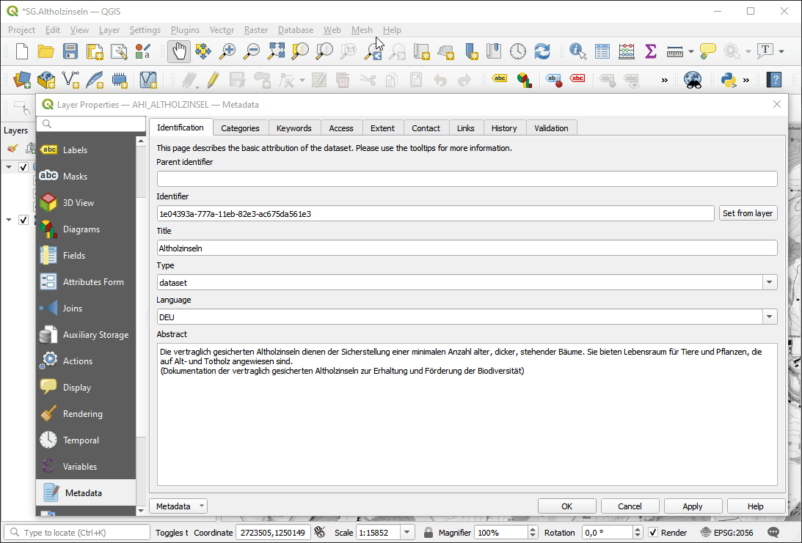

# QGIS Geocat Export

## What is QGIS Geocat Export?
QGIS Geocat Export is a QGIS plugin that lets you export layer metadata to a geocat.ch compatible XML format.

## How do I get started?
1. Complete the layer's metadata (mandatory properties are: _title_, _abstract_, _contact_ and _extent_).
2. Launch the file export by clicking the context menu entry **Export layer metadata for geocat.ch** on the given layer.
3. The geocat.ch compatible XML file is written to the home directory of the current user.

## Known limitations and restrictions
- `fileIdentifier`: if no identifier is specified, a new UUID will be generated on each export.
- The validation does not validate catalogized values like contacts, extents and distribution formats.
- Currently, only the type `dataset` can be exported. Other types (e.g. `service`) are not supported.
- The export writes two date fields: The begin date of the temporal extent is interpreted as creation time (`DataIdentification.Date`), while the export date is set as the timestamp of the metadata file.
- The export writes no distribution format. The related elements are created but empty.

## Where can I get it?
Install the [QGIS Geocat Export Plugin](https://plugins.qgis.org/plugins/geocat_export) directly in QGIS by using the [Plugins menu](http://docs.qgis.org/latest/en/docs/user_manual/plugins/plugins.html).

## License
The QGIS Geocat Export Plugin is licensed under the [GPL-3.0 license](LICENSE).  
Copyright © 2021 [GeoWerkstatt GmbH](https://www.geowerkstatt.ch)
